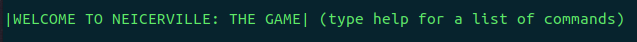

# Neicerville Game

A text based adventure game written in Java. Players can equip weapons, attack enemies, consume health items, speak to NPCs, and win boss fights to progress through the story.



## Setup

To play the Neicerville Game, you will need to download the JDK for your operating system from the <a href="https://www.oracle.com/java/technologies/downloads/">oracle website.</a> After downloaded, please clone this repo and run the jar file with the below commands.

```
git clone https://github.com/aleckondichook/neicerville-game
cd neicerville-game
java -jar neicerville_game.jar
```